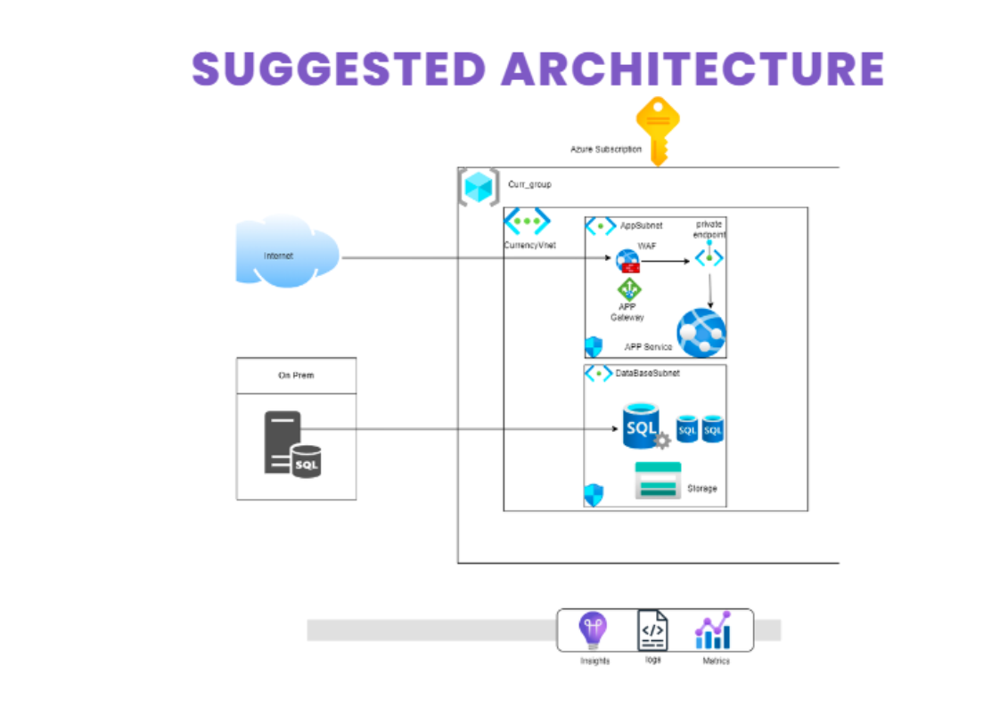
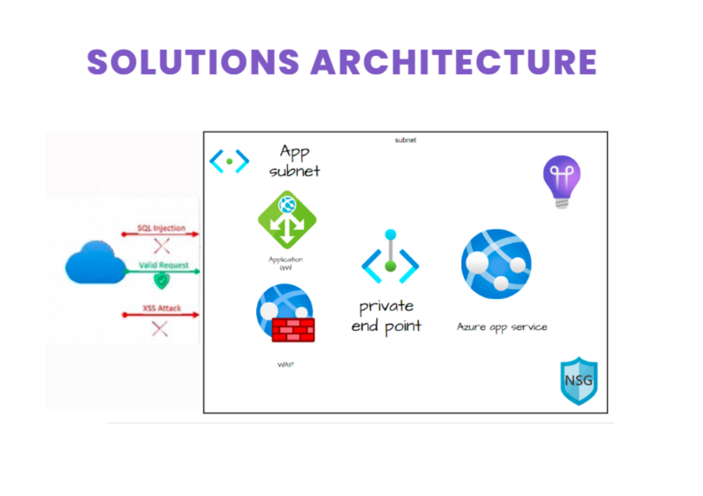

# DEPLOYMENT-MIGRATION
### 1-BUSINESS REQUIREMENT

- DEPLOY AND HOST THE WEB APPLICATION ON AZURE TO IMPROVE PERFORMANCE AND REDUCE MAINTENANCE COSTS.
- MIGRATE DATABASES DB1 AND DB2 TO AZURE TO LEVERAGE THE CLOUD'S SCALABILITY AND RELIABILITY.
- MINIMIZE ADMINISTRATIVE EFFORT AND COSTS BY UTILIZING AZURE'S MANAGED SERVICES AND AUTOMATION CAPABILITIES.

### 2-APP AND IT’S DEPLOYMENT
#### REQUIREMENTS FOR THE CURRENCY CONVERTER WEB APP
A WEB-BASED CURRENCY CONVERTER THAT RELIES ON AN API TO FETCH REAL-TIME CURRENCY RATES.

1- SCALABILITY
2- AVAILABILITY
3- SECURITY
4- TRAFFIC MANAGEMENT

#### WHAT AND WHY WE CHOOSE THIS OPTION 
1. AZURE APP SERVICE: HOSTING PLATFORM
HERE’S WHY:
•PAAS BENEFITS
•COST EFFICIENCY
•MINIMAL MAINTENANCE REQUIRED AND HIGH PERFORMANCE WITH BUILT-IN SUPPORT FOR APIS.
•BUILT-IN SECURITY AND MONITORING

2. NAT GW: SECURING OUTBOUND TRAFFIC
HERE’S WHY:
•OUTBOUND SECURITY
•PUBLIC IP PROTECTION
•SCALABILITY

3. APPLICATION GATEWAY: MANAGING AND SECURING INBOUND TRAFFIC
HERE’S WHY:
•INBOUND TRAFFIC MANAGEMENT
•SSL TERMINATION
•WEB APPLICATION FIREWALL (WAF)
•SCALABILITY

4. NETWORK SECURITY GROUPS (NSGS): CONTROLLING NETWORK TRAFFIC
HERE’S WHY:
•GRANULAR TRAFFIC CONTROL
•LAYERED SECURITY
•COST EFFICIENCY

#### HOW IS THE DEPLOYMENT DONE?
•VIRTUAL NETWORK
•SUBNET WITH NSG
•NAT GATEWAY
•APPLICATION GATEWAY
•AZURE APP SERVICE

•USER REQUESTS: WHEN A USER ACCESSES THE APP, THEIR REQUEST GOES THROUGH THE APPLICATION GATEWAY.
•SSL Termination & WAF: The Application Gateway terminates the SSL connection, inspects traffic for security vulnerabilities using WAF, and then routes it to the app instances.
•App Processing: The web app handles the request and sends the response back via the Application Gateway.
•Outbound Protection: Any potential outbound traffic is securely routed through the NAT Gateway, preventing exposure of the app’s internal IPs

